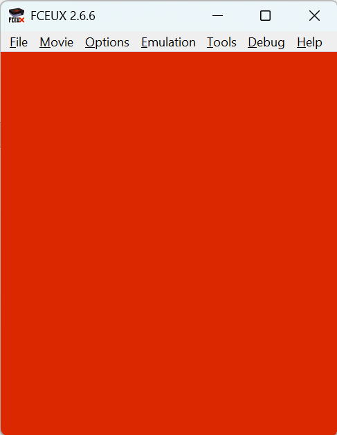

# NES Assembly Tutorial

# 00 Setup

- Task 1: Install the assembler and linker https://cc65.github.io
- Task 2: Install a NES emulator https://fceux.com `sudo apt install fceux`
- Task 3: Install a tile editor https://github.com/toruzz/TileMolester `java -jar tm.jar` or `java -jar TileMolester.jar`
- Task 4: What computers used the 6502 micro processor? What are the registers and their purpose? Use this link: https://en.wikipedia.org/wiki/MOS_Technology_6502

# 01 Background Color

- Example: Sets the background color to blue [01_example.asm](./code/01_example.asm)

- Task 1: Assemble and link the file and create a nes file using `ca65` and `ld65`. 
  The command is at the top of the first example.

- Task 2: Look up the assembly commands in the StartUp segment and describe what they do. Ignore all memory addresses for now. Use this link: http://mimuma.pl/opcodes/ 

- Task 3: Look up every memory address (like $2000) and find the name of the hardware register which is mapped to this location. Use this link: http://en.wikibooks.org/wiki/NES_Programming

- Task 4: Look up the effect of every Bit of the `PPUCTRL` ($2000) and `PPUMASK` ($2001) register. Use this link: http://nesdev.org/wiki/PPU_registers

- Task 5: Explain how the example writes the colors to the PPU RAM using this picture: [cpu_ppu_communication](
https://bugzmanov.github.io/nes_ebook/images/ch6.1/image_2_cpu_ppu_communication.png)
- Task 6: Open the NES file with fceux. 
  Compare the numbers in `PaletteData` in the assembly file with the numbers shown in fceux `Tools->Palette Editor`.

- Exercise: Set the background color to red [01_solution.asm](./code/01_solution.asm)

# 02 Tile Graphics

- Example: Shows a 8x8 pixel tile.

- Task 1: Change the Bits of the `PPUMASK` ($2001) register and verify your expectations.

- Task 2: Explain the number of bytes needed by a the CHR file. `tilemap01.chr` is a "2bpp planar, composite" tile set. How many Bytes are needed for 32x16 tiles of 8x8 pixel if four colors are used?

- Task 3: Compare the tile map using CHR editor and `Debug-> PPU Viewer` and `Debug->Name Table Viewer`. What is a name table and pattern table 0 and pattern table 1. Use this picture: https://bugzmanov.github.io/nes_ebook/images/ch6.1/image_1_ppu_registers_memory.png

- Task 4: Edit the CHR file or create your own. Add some tiles.

- Exercise: Show the text "Hello World!" on the screen.

# 03 Show Sprites

- Example: Shows a 8x8 pixel sprite.

- Exercise: Change the sprite position on the screen.

- Exercise: Change the sprite color.

# 04 Moving Sprites

- Example: Moves a 8x8 pixel sprite.

- Exercise: Move the sprite in a different direction

# 05 Controller Input

- Example: A sprite is moved by the game pad left and right buttons.

- Exercise: Move the sprite with all keys. Also include the 4 buttons.